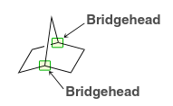
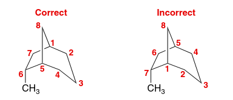

:PROPERTIES:
:ID:       7d909730-fd0d-4dc3-b4c5-1da6462605f6
:END:
#+title: Naming Bicyclic Compounds
[[id:aeea0db1-b7c2-4fa7-8b7d-2f66f971b644][Nomenclature]]
* Naming bicyclic alkanes
- Find the two bridgehead carbons (carbons where rings are joined together)
- Number lengths of paths between bridgeheads, and order from largest/smallest
- Example: this is bicyclo[2,2,1]heptane
  
- For substituents, the rings must be numbered:
  - Start at one bridgehead and take the longest path, numbering along the way
  - Then take the second longest path, and so on
  - When there is a difference in numbers given to the substituent (by different starting carbons), choose the one with the lower number
    
